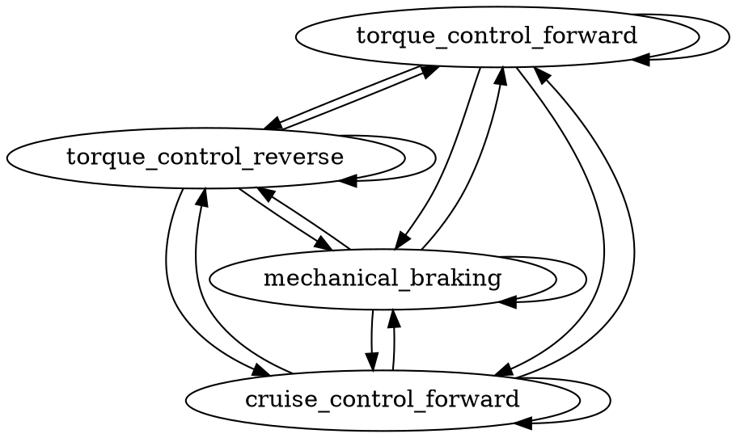
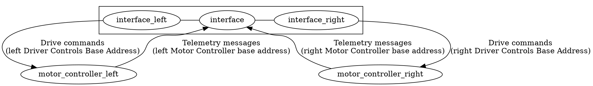

# Motor Controller Interface

## Summary

This implements a **motor controller interface** that translates CAN messages 
sent from our CAN network to the private CAN network that the motor controllers
run on, allowing us to direct the NuGen Mobility SCM-150 motors.

## Motivation

The manufacturer's CAN network operates in a different way compared to our CAN 
network. As a result, we want to be able to treat our CAN network and the 
external CAN network as two separate entities, and then have this act as a 
bridge between the two.

This is useful in cases where, for example, we want to send telemetry values 
grouped by a logical grouping by each motor controller as opposed to 
Left/Right. Or isolating the Motor Controllers from traffic running on our bus.

## Detailed Design

Events are received from the Driver Controls board, which are then dumped into 
a FIFO for processing. A FIFO event is raised when a new item is added:

* Direction: the direction that the car should drive in
* Speed: the target speed of the car
* Brake State: the state of the mechanical brake
* Cruise Target: the target speed of the car (for cruise control)

On each iteration of the main loop, the FSM attempts to transition using the 
first value in the FIFO. If it is able to transition, then we pop the item and 
transition.

In addition, we need to perform some bookkeeping to ensure that we are sending 
the correct values. This can be done in the output functions.

A `CanInterval` is used to periodically send the messages to each of the motor 
controllers. Since the `CanInterval` object is intended to be used for a 
persistent periodic message, we directly manipulate the stored object before 
each CAN transmission.

Each Motor Controller has a unique ID. Moreover, each *logical* Motor 
Controller Interface *also* has a unique ID. This allows Motor Controllers to 
distinguish messages sent to each, and allows us to distinguish telemetry 
messages from each (since CAN is a message-based protocol).

%22];interface_right%20-%3E%20motor_controller_right%20[label=%22Drive%20commands\n(right%20Driver%20Controls%20Base%20Address)%22];motor_controller_left%20-%3E%20interface%20[label=%22Telemetry%20messages\n(left%20Motor%20Controller%20base%20address)%22];motor_controller_right%20-%3E%20interface%20[label=%22Telemetry%20messages\n(right%20Motor%20Controller%20base%20address)%22];subgraph%20cluster%20{{rank=same%20interface_left%20interface%20interface_right};interface_left%20-%3E%20interface%20-%3E%20interface_right%20[arrowhead=none];}})

### Torque Control

Torque Control is used for **Forward**, **Reverse**, and **Braking** states. 
We set the velocity to an unobtainable value (we use +/- 100 m/s) and then set 
the current to the proportion of total available torque.

### Cruise Control

Cruise Control is a special mode where the car aims to maintain speed, using 
its internal controls magic to determine how much torque to drive.

Instead of running both Controllers in Cruise Control mode, we only put one in 
Cruise Control, and then drive the other in Torque Control, copying over the 
current value from the other Controller via the Telemetry values.
